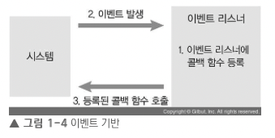

## Node의 특성

### 1. 이벤트 기반

- `이벤트`가 발생할 때 미리 지정해둔 작업을 수행하는 방식
    - 이벤트의 예시: 버튼 클릭, 네트워크 요청, 타이머 등
    - 이벤트 리스너: **이벤트를 등록**하는 함수
    - 콜백 함수: **이벤트가 발생했을 때 실행**될 함수
- 즉 어떤 동작을 할 때, 다른 동작에 그에 따라서 일어나는 것을 의미한다.

노드도 이벤트 기반 방식으로 동작하는데, 이벤트가 발생하면 이벤트 리스너에 등록해둔 콜백 함수를 호출한다. 발생한 이벤트가 없거나 발생했던 이벤트를 다 처리하면, 노드는 다음 이벤트가 발생할 때까지 대기한다.

이벤트 기반 모델에서는 이벤트 루프(event loop)가 있는데, 이 이벤트 루프는 여러 이벤트가 동시에 발생했을 때 어떤 순서로 콜백 함수를 호출할지를 판단한다.

### 2. 논블로킹 I/O

> 논 블로킹: 오래 걸리는 함수를 백그라운드로 보내서 다음 코드가 먼저 실행되게 하고, 나중에 오래 걸리는 함수를 실행

- 논 블로킹 방식 하에서 일부 코드(I/O작업)는 **백그라운드에서 병렬로 실행**된다. 즉, `비동기/논블로킹` 방식으로 실행된다.
    - 즉, 비동기/논블로킹은 **동시에 실행되는 것이 아니다.**
- 나머지 코드들은 동기/블로킹 방식으로 실행된다.
- **I/O 작업이 많을 때 노드 활용성이 극대화된다.**
- 노드는 `동기/블로킹` 또는 `비동기/논블로킹` 으로 동작한다.

### 3. 싱글 스레드

- 노드 프로세스는 멀티 스레드이지만 **직접 다룰 수 있는 스레드는 하나**이기 때문에 `싱글 스레드`라고 표현한다.
    - 노드는 `싱글 스레드/논블로킹` 모델을 사용한다.
    - **I/O 관련 코드가 아닌 경우**에는 싱글 스레드/블로킹 모델과 같아진다.
- 노드는 주로 **멀티 스레드 대신에 멀티 프로세스를 활용**한다.
- 노드 14버전부터 멀티 스레드를 사용할 수 있다.