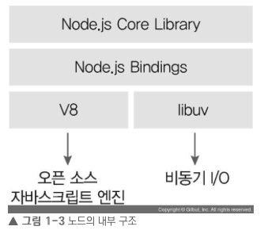

## Node의 정의

- Node.js 는 크롬 V8 자바스크립트 엔진으로 빌드된 `자바스크립트 런타임`이다.
    - Node.js가 나옴으로써 html안의 script태그 안에서만 실행할 수 있었던 자바스크립트가 독립적으로 빠른 속도로 실행할 수 있게 되었다.

> 런타임: 특정 언어로 만든 프로그램들을 실행할 수 있게 해주는 가상 머신(크롬의 V8 엔진 사용)의 상태

- 즉, **서버의 역할도 수행**할 수 있는 자바스크립트 런타임이다.
- 따라서 노드로 자바스크립트로 작성된 서버를 실행할 수 있다.
- 서버 실행을 위해서 필요한 `http`/`https`/`http2` 모듈을 제공한다.

## Node의 내부 구조

- 노드는 `V8`과 `libuv`를 내부적으로 포함한다.
    - V8 엔진: 오픈소스 자바스크립트 엔진 -> 속도 문제를 개선
    - libuv: 노드의 특성인 이벤트 기반, `논블로킹 I/O 모델`을 구현한 라이브러리

